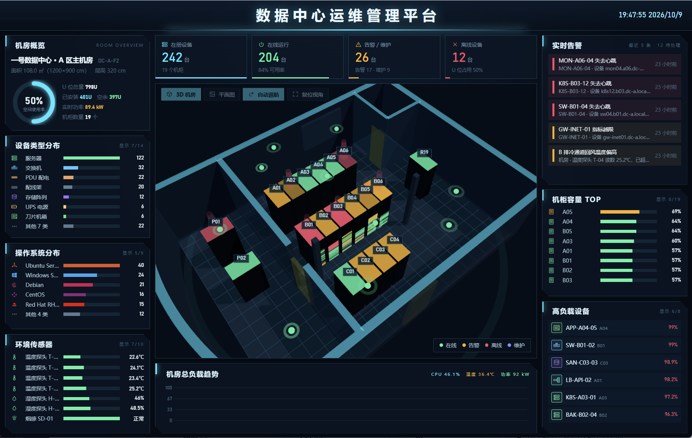
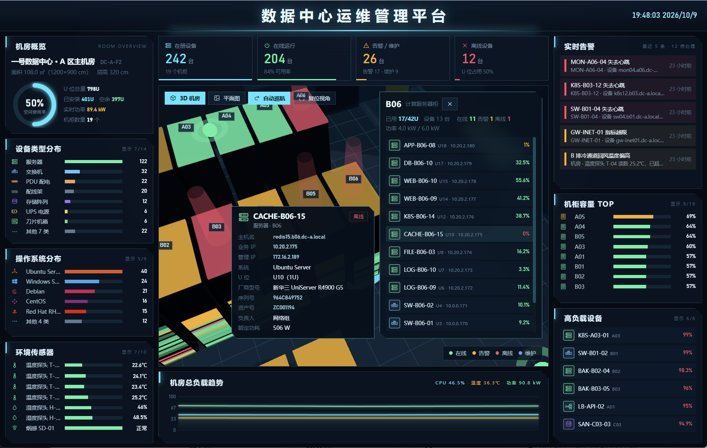

<div align="center">

# 🛡️ RackSentinel

### Data Center Infrastructure & Rack Asset Management

**机房资产与运维管理平台 · Data Center Infrastructure Management**

自绘机房平面图 · 机柜 U 位资产管理 · 运维状态可视化

<br />

[](https://www.php.net/)
[](https://www.mysql.com/)
[](https://www.sqlite.org/)
[](#-rest-api)
[](https://threejs.org/)

[功能特性](#-功能特性) · [界面预览](#-界面预览) · [快速开始](#-快速开始) · [技术架构](#-技术架构) · [路线图](#-路线图)

</div>

---

## 📖 项目简介

**RackSentinel** 是一个面向数据中心机房的资产与运维管理平台，提供机房平面图设计、机柜 U 位管理、设备清单、运维大屏及告警管理等功能。

项目采用 **纯 PHP + PDO + 原生 JavaScript** 构建，无需 Composer、无需前端构建工具；支持 MySQL 与 SQLite，适合本地体验、私有化部署及二次开发。

> **当前版本：`v0.1`**
>
> 当前版本已实现主要后台界面与数据模型，部分运行指标为模拟数据。Zabbix、Prometheus、SNMP 及环境传感器等真实数据采集能力规划在后续版本中接入。

## 🖼️ 界面预览

### 运维大屏 · Operations Dashboard

<p align="center">
  
  
</p>

### 机房平面图设计 · Floor Plan Designer

<p align="center">
  
</p>

### 机柜 U 位编辑 · Rack Layout Editor

<p align="center">
  
</p>

### 资产管理 · Asset Management

<p align="center">
  
</p>

> 图片存放于 [`Preview/`](./Preview) 目录。若图片未正常显示，请检查文件名大小写及路径是否与仓库中的文件一致。

## ✨ 功能特性

| 功能模块 | 能力说明 |
| --- | --- |
| 🖥️ **运维大屏** | 3D 机房与平面图视图、设备状态统计、U 位容量与功率、告警概览及负载趋势；默认每 5 秒轮询 |
| ✏️ **平面图设计器** | 绘制墙体、玻璃隔断、门、窗、柱；放置机柜与环境传感器；支持网格吸附、撤销与重做 |
| 📐 **机柜 U 位管理** | 42U 机柜立面图；拖动设备调整 U 位或跨柜搬迁；维护设备名称、主机名、IP、型号及资产编号 |
| 🔍 **设备资产清单** | 按名称、主机名、IP、型号、资产编号搜索，并按设备类型、操作系统、状态和机柜筛选 |
| 📤 **Excel 导入 / 导出** | 导出设备清单与逐柜 U 位图；支持批量新增、更新、删除，导入前执行整批校验 |
| 🚨 **告警管理** | 查看告警列表并确认告警 |
| ⚙️ **系统设置** | 配置站点名称、大屏标题、刷新间隔及账号密码 |
| 🧭 **3D 机房场景** | 使用 Three.js 展示三维场景；加载失败时自动回退到平面图 |

**支持的设备类型**

服务器、刀片机箱、交换机、路由器、防火墙、网关、负载均衡、存储阵列、磁带库、UPS、PDU、KVM、控制台、配线架、盲板。

**环境传感器类型**

温度、湿度、烟感、漏水、配电。

## 🧰 技术栈

| 层级 | 技术 |
| --- | --- |
| 后端 | PHP 8.0+、PDO 预处理、REST API 单入口 |
| 数据库 | MySQL 5.7+/8.0 或 SQLite，双驱动可切换 |
| 前端 | 原生 JavaScript，无前端框架、无构建步骤 |
| 3D 场景 | Three.js（通过 CDN 加载） |
| 图标 | SVG 图标雪碧图 |
| Excel | 纯 PHP 实现的 XLSX 读写库，无额外依赖 |

## 🚀 快速开始

### 环境要求

- PHP **8.0+**
- MySQL **5.7+/8.0**，或启用 `pdo_sqlite` 使用 SQLite
- 任意可运行 PHP 的 Web 服务器
- 使用 MySQL 时需启用 `pdo_mysql`

### 1. 获取项目

```bash
git clone https://github.com/Viecent-magiclight/RackSentinel-DCIM.git
cd RackSentinel-DCIM
```

### 2. 配置数据库

编辑 `config/config.php` 中的数据库连接配置，例如：

```php
'mysql' => [
    'host'     => '127.0.0.1',
    'port'     => 3306,
    'database' => 'server_rack',
    'username' => 'root',
    'password' => 'your_password',
    'charset'  => 'utf8mb4',
],
```

数据库账号需要具备创建数据库的权限；如果数据库已提前创建，则需要具备建表权限。

### 3. 安装并初始化数据

浏览器访问 `install.php`，点击“开始安装并写入样本数据”。

也可以通过命令行安装：

```bash
php install/cli.php
```

安装脚本会创建表结构并写入演示数据，包括机房、平面图元、机柜、设备、传感器、指标历史及告警样本。

> ⚠️ **注意：安装脚本会先删除并重建相关数据表。重新安装可能清空现有数据，请勿直接在含有重要数据的环境中执行。**

### 4. 启动并访问

将 Web 服务器站点根目录指向项目目录，然后打开 `index.php` 访问运维大屏。

如需使用 PHP 内置服务器进行本地体验：

```bash
php -S 127.0.0.1:8123 -t .
```

然后访问 `http://127.0.0.1:8123`。

## 🪶 使用 SQLite 快速体验

不想配置 MySQL？可以通过环境变量切换到 SQLite。数据文件会写入 `storage/server_rack.sqlite`。

**Linux / macOS**

```bash
RACK_DB_DRIVER=sqlite php install/cli.php
RACK_DB_DRIVER=sqlite php -S 127.0.0.1:8123 -t .
```

**Windows PowerShell**

```powershell
$env:RACK_DB_DRIVER = "sqlite"
php install/cli.php
php -S 127.0.0.1:8123 -t .
```

MySQL 与 SQLite 使用一致的表结构，可按需切换数据库驱动。

## 🏗️ 技术架构

```text
┌──────────────────────────────────────────────────────────────┐
│                        Web UI                                │
│  运维大屏 · 平面图设计 · 机柜 U 位 · 设备清单 · 系统设置        │
└──────────────────────────────┬───────────────────────────────┘
                               │
┌──────────────────────────────▼───────────────────────────────┐
│                       REST API                               │
│             api/index.php?r=<resource>.<action>              │
│                   GET 读取 · POST + JSON 写入                 │
└──────────────────────────────┬───────────────────────────────┘
                               │
┌──────────────────────────────▼───────────────────────────────┐
│                         PHP 层                                │
│  db.php · auth.php · catalog.php · helpers.php · xlsx.php     │
└──────────────────────────────┬───────────────────────────────┘
                               │
┌──────────────────────────────▼───────────────────────────────┐
│                    MySQL / SQLite                             │
│  rooms · racks · devices · device_metrics · alerts · users    │
└──────────────────────────────────────────────────────────────┘
```

### 核心数据关系

- `rooms`：机房；关联 `walls`、`racks`、`sensors`
- `racks`：机柜；关联按 U 位安装的 `devices`
- `devices`：设备；关联 `device_metrics` 指标历史与 `alerts` 告警
- `users`、`settings`、`login_attempts`：账号、站点设置与登录限速相关数据

## 🔌 REST API

统一接口入口：

```text
api/index.php?r=<resource>.<action>
```

读取请求使用 `GET`，写入请求使用 `POST + JSON body`。

| 路由 | 说明 |
| --- | --- |
| `meta` | 获取设备类型、操作系统、状态等目录 |
| `room.list` / `room.save` | 机房相关接口（为后续多机房能力预留） |
| `layout.get` / `layout.save` | 读取与保存平面图布局 |
| `rack.list` / `rack.get` / `rack.save` / `rack.delete` | 机柜查询与维护 |
| `device.list` / `device.get` / `device.save` / `device.move` / `device.delete` | 设备维护与 U 位搬迁 |
| `dashboard.summary` | 获取大屏汇总数据 |
| `metrics.tick` | 推进一轮指标数据（当前为模拟数据） |
| `alert.list` / `alert.ack` | 告警查询与确认 |

设备保存、设备搬迁及 Excel 导入会校验 U 位是否越界或重叠；发生冲突时返回 `HTTP 422`。

## 🔐 安全设计

- 使用 **bcrypt** 哈希密码
- 登录失败按来源 IP 限速，降低暴力破解风险
- 会话 Cookie 使用 `HttpOnly` 与 `SameSite=Lax`
- 写入接口执行同源校验，降低 CSRF 风险
- 登录成功后调用 `session_regenerate_id`，防止会话固定
- 使用 PDO 预处理语句访问数据库
- 写入字段通过白名单筛选
- 提供 `install/verify.php` 对样本数据进行一致性检查

## 🗺️ 路线图

### v0.2 · 数据采集

当前 `metrics.tick` 使用模拟数据用于演示。后续计划包括：

- [ ] **多机房支持**：机房切换、跨机房聚合视图及全局资产统计
- [ ] **环境传感器接入**：真实数据上报、阈值告警与历史曲线
- [ ] **交换机 SNMP**：端口状态、流量、链路信息及设备发现
- [ ] **监控平台适配**：接入 Zabbix、Prometheus 等数据源
- [ ] **统一数据接入**：为不同探针提供一致的数据上报方式

### 后续规划

- 跨机房统一拓扑与网络链路可视化
- 设备生命周期、维护计划与工单
- RBAC 多角色权限管理
- 邮件、企业微信及 Webhook 告警通知
- 3D 场景本地化，支持离线部署

## 📁 目录结构

```text
config/config.php       数据库与应用配置
lib/db.php              PDO 封装（MySQL / SQLite）
lib/auth.php            会话登录、同源校验、IP 限速
lib/catalog.php         设备类型、操作系统及传感器目录
lib/helpers.php         U 位冲突检测、机柜统计、导航渲染
lib/xlsx.php            XLSX 读写
api/index.php           REST API 单入口
partials/               页面公共组件
assets/css/app.css      全局样式
assets/js/common.js     API 封装、图标、模态框及图表
assets/js/planner.js    平面图设计器
assets/js/rackview.js   机柜 U 位编辑器
assets/js/dashboard.js  运维大屏
assets/js/scene3d.js    三维机房场景
install/                建表脚本、样本数据、安装及校验工具
Preview/                README 界面预览图
```

## 📝 注意事项

- **3D 场景依赖 CDN**：Three.js 从 CDN 加载；内网环境可改为本地资源。加载失败时会回退到平面图。
- **指标历史写入节流**：大屏默认每 5 秒轮询，但历史指标按节流策略写入，以控制数据增长。
- **平面图坐标单位**：使用厘米；机柜 `x` / `y` 为柜体中心，`rotation` 支持 `0/90/180/270`。
- **U 位编号**：U1 位于机柜底部，编号向上递增。
- **数据采集状态**：当前版本的运行指标为模拟数据，接入真实监控平台属于后续迭代内容。

## 📄 License

RackSentinel is licensed under the MIT License.

---

<div align="center">

**RackSentinel · 让每一 U 空间一目了然**

*Every rack unit, crystal clear.*

Made with ❤️ · PHP · SQLite / MySQL · Vanilla JavaScript · Three.js

</div>
